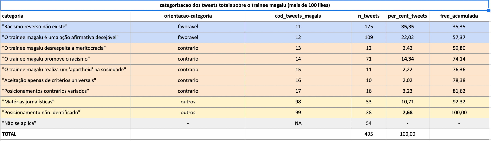
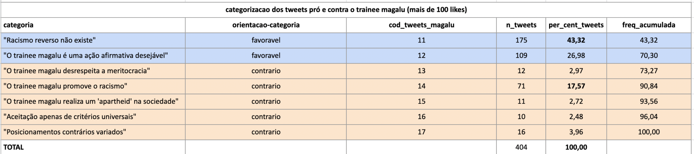

```{r setup, include=FALSE}
knitr::opts_chunk$set(echo = FALSE, message = FALSE, warning = FALSE)
```

## TABELA 1: Categorização dos tweets totaissobre o trainee magalu (mais de 100 likes)

### Referência:



### Tabela gerada com R

```{r}
library(tidyverse)
library(flextable)

gerar_flextable_categorias <- function(df){
  df |> 
  flextable() |> 
  flextable::autofit() |> 
  bg(i = ~ `Orientação da categoria` == "Favorável", bg = "#c9dbf9", part = "body") |> 
  bg(i = ~ `Orientação da categoria` == "Contrário", bg = "#fbe3cb", part = "body") |> 
  bg(i = ~ `Orientação da categoria` == "Outros", bg = "#fdf1ca", part = "body") |> 
  fontsize(i = NULL, j = NULL, size = 10, part = "all") |> 
  font(i = NULL, j = NULL, fontname = "Arial", part = "all") |> 
  set_formatter( `Porcentagem` =  function(x) sprintf( "%.1f%%", x*100 ))
}
```

```{r}
base_categorizada_completa <-
  readr::read_rds("data/base_categorizada_completa.rds") |>
  dplyr::mutate(orientacao_categoria = forcats::fct_relevel(orientacao_categoria, c("favoravel", "contrario", "outros")))
```

```{r}
dados_tabela_1 <- base_categorizada_completa |> 
  dplyr::group_by(categoria, orientacao_categoria) |> 
  dplyr::summarise(n_tweets = dplyr::n()) |> 
  dplyr::arrange(orientacao_categoria, desc(n_tweets)) |> 
  dplyr::ungroup() |> 
  dplyr::mutate(percent_tweets = n_tweets/sum(n_tweets),
                freq_acumulada = purrr::accumulate(percent_tweets, `+`),
               # percent_tweets = scales::percent(percent_tweets),
                freq_acumulada = scales::percent(freq_acumulada),
                orientacao_categoria = orientacao_categoria |> 
                  stringr::str_replace("favoravel", "Favorável") |> 
                  stringr::str_replace("contrario", "Contrário") |> 
                  stringr::str_replace("outros", "Outros")) |> 
  
  dplyr::rename(Categoria = categoria,
                `Orientação da categoria` = orientacao_categoria,
                `Quantidade de tweets` = n_tweets,
                `Porcentagem` = percent_tweets, 
                `Frequência acumulada` = freq_acumulada) 

dados_tabela_1 |> 
  janitor::adorn_totals() |> 
  gerar_flextable_categorias()


```

## Tabela 2: categorizacao dos tweets pró e contra o trainee magalu

### Referência




### Tabela gerada com R

```{r}
dados_tabela_2 <-  base_categorizada_completa |> 
  dplyr::filter(orientacao_categoria != "outros") |> 
    dplyr::group_by(categoria, orientacao_categoria) |> 
  dplyr::summarise(n_tweets = dplyr::n()) |> 
  dplyr::arrange(orientacao_categoria, desc(n_tweets)) |> 
  dplyr::ungroup() |> 
  dplyr::mutate(percent_tweets = n_tweets/sum(n_tweets),
                freq_acumulada = purrr::accumulate(percent_tweets, `+`),
               # percent_tweets = scales::percent(percent_tweets),
                freq_acumulada = scales::percent(freq_acumulada),
                orientacao_categoria = orientacao_categoria |> 
                  stringr::str_replace("favoravel", "Favorável") |> 
                  stringr::str_replace("contrario", "Contrário") |> 
                  stringr::str_replace("outros", "Outros")) |> 
  
  dplyr::rename(Categoria = categoria,
                `Orientação da categoria` = orientacao_categoria,
                `Quantidade de tweets` = n_tweets,
                `Porcentagem` = percent_tweets, 
                `Frequência acumulada` = freq_acumulada) 


dados_tabela_2 |> 
  janitor::adorn_totals() |> 
  gerar_flextable_categorias()

```
